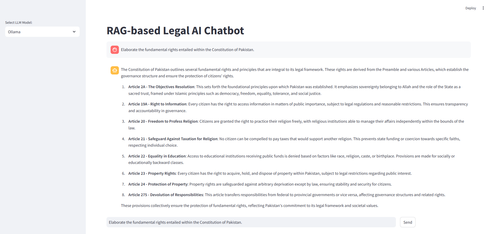

# OpenRAG

## Overview

This project implements a Retrieval-Augmented Generation (RAG) based AI chatbot specialized in answering legal questions about Pakistani laws. The chatbot integrates multiple open-source LLM implementations, offering three different ways to generate responses:

- **ChatGroq** (Cloud-hosted LLM using `langchain_groq` API)
- **Ollama** (Local model execution using `ollama` API)
- **Hugging Face Transformers** (Locally run transformer models using PyTorch)

The chatbot retrieves relevant legal context from a **ChromaDB vector store** before generating responses. The project also includes a document processing script to convert legal documents (PDFs) into vector embeddings, which are stored in ChromaDB for efficient retrieval.

## Features

✅ **Multi-LLM Support**: Choose between ChatGroq, Ollama, and Hugging Face models for response generation.

✅ **Context-Aware Retrieval**: Uses ChromaDB and HuggingFaceBgeEmbeddings to fetch relevant information.

✅ **Streamlit UI**: Provides an easy-to-use web interface for interaction.

✅ **Document Vectorization**: Converts documents into embeddings for better contextual understanding.

✅ **Persistent Chat Memory**: Maintains conversation history for coherent multi-turn interactions.

## Installation and Setup

To set up the project, install the required dependencies:

```bash
pip install -r requirements.txt
```
### Installing Tesseract OCR

Ensure that Tesseract OCR is installed for PDF text extraction:

- **Ubuntu**: `sudo apt install tesseract-ocr`
- **MacOS (Homebrew)**: `brew install tesseract`
- **Windows**: [Download and install from Tesseract GitHub](https://github.com/tesseract-ocr/tesseract)

### Installing Ollama

To run local models via Ollama, install it by following the instructions on the [Ollama website](https://ollama.ai/download).

After installation, download the required model:

```bash
ollama run deepseek-r1:8b
```

### Setting up LLMs

In case of setting up different open source available LLMs, try the following:

✅ **ChatGroq**: Visit ChatGroq [webpage](https://console.groq.com/docs/models) to check the avaiable LLM support.

✅ **Ollama**: Visit Ollama [library](https://ollama.com/library) to check the avaiable LLM support.

✅ **Hugging Face**: Visit Hugging Face [library](https://huggingface.co/models) to check the avaiable LLM support and respective LLM implementations.

## Usage

### Running the Streamlit Chatbot

```bash
streamlit run streamlit.py
```

This will launch the chatbot interface in a web browser.

### Adding Documents to ChromaDB

To preprocess and store documents as vector embeddings:

```bash
python document_vectorization_script.py path/to/legal_document.pdf
```

### Selecting an LLM

The chatbot allows selection of different LLMs via a dropdown menu:

- **Groq**: `llama-3.3-70b-versatile`
- **Ollama**: `deepseek-r1:8b`
- **Hugging Face**: `deepseek-ai/deepseek-v2`

## Project Structure

```
├── llm_service.py                 # Handles response generation from Groq, Ollama, or Hugging Face models
├── retrieval_service.py           # Retrieves relevant legal context from ChromaDB
├── streamlit.py                   # Streamlit-based web interface for user interaction
├── document_vectorization_script.py  # Processes PDFs and stores embeddings in ChromaDB
├── requirements.txt               # List of dependencies
└── chroma_db/                     # Directory for storing ChromaDB embeddings
```

## Project Sample



## Components

### 1. LLM Service (`llm_service.py`)

This module defines an `LLMService` class that interacts with three different LLM implementations:

- **Groq Execution** (`groq_execution`)
- **Ollama Execution** (`ollama_execution`)
- **Hugging Face Execution** (`hugging_face_execution`)

### 2. Retrieval Service (`retrieval_service.py`)

Retrieves relevant text from ChromaDB, using **HuggingFaceBgeEmbeddings** for vectorization.

### 3. Streamlit UI (`streamlit.py`)

Provides an interactive chatbot interface with:

- LLM selection dropdown
- Chat history management
- Query input and response display

### 4. Document Processing (`document_vectorization_script.py`)

Converts PDFs into vector embeddings for efficient retrieval.

## Future Improvements

- Expand to support multiple legal domains beyond Pakistani laws.
- Add support for more open-source LLMs.
- Improve retrieval mechanisms for more accurate context selection.
- Optimize response generation for better accuracy and efficiency.

## Contributing

Feel free to contribute by improving model integrations, retrieval strategies, or the UI.

## Acknowledgments

Special thanks to the open-source communities behind **LangChain, ChromaDB, Hugging Face,** and **OpenAI** for enabling this project.
